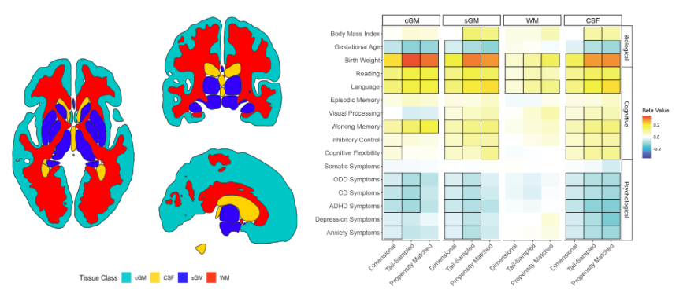

# Comparing Brain-Behavior Relationships Across Dimensional, Tail-Sampled, and Propensity-Matched Models #
*Large population cohorts are needed to perform brain-wide association studies (BWAS), with evidence that sampling from the tails of a distribution increases effect sizes and improves reproducibility. However, studies rarely compare how variability in sample sociodemographic characteristics relates to imaging or behavioral phenotypes within BWAS. To address this gap, we derived estimates for brain-behavior associations using multivariate regression models, comparing effects sizes for dimensional, tail-sampled, and propensity matched groups. Data were obtained from the Adolescent Brain Cognitive Development (ABCD) Study®.*

## Project Lead
Kristin A. Murtha

## Senior Authors 
Rebecca Waller, Jakob Seidlitz 

## Collaborators 
Lena Dorfschimidt, Richard A.I. Bethlehem, Aaron F. Alexander-Bloch

## Project Start Date 

## Datasets 

## Conference Presentations 
- Brain-Behavior relationships in Dimensional, Tail-Sampled, and Propensity Matched Models. Poster presented at the ABCD Insights and Innovations Meeting, March 2024. 

# Code Documentation 
*All analysis was completed in R, utilizing [MatchIt](https://cran.r-project.org/web/packages/MatchIt/index.html) and [Lavaan](https://lavaan.ugent.be) packages.*

## Image Preprocessing 
Details of data processing for the imaging-derived phenotypes for the ABCD study, as well as the population normative models (“brain charts”), are described in [Bethlehem et al., 2022](https://www.nature.com/articles/s41586-022-04554-y). 

## Sample Selection + Data Organization
1. Run [Step00_Organize_Data.Rmd](https://github.com/krmurtha1/BWAS_matching/blob/main/Step_00_Organize_data.Rmd) to organize variables needed for matching/sample creation. 
2. Run [Step01_Match_On_Centiles.Rmd](https://github.com/krmurtha1/BWAS_matching/blob/main/Step_01_Match_on_Centiles.Rmd) to create tail-sampled and matched datasets. 
> This script generates Missingness Comparisons and Love Plots found in Figures S2, S3. 

## Whole Brain Modeling 
1. Use [Step02_Model_CBCL_by_Centile.Rmd](https://github.com/krmurtha1/BWAS_matching/blob/main/Step_02_Model_CBCL_by_Centile.Rmd) to model clinical outcomes as a function of whole brain measures. 
> This script generates tables S15-S18 and a .csv of beta's for use in Figure 1. 
2. Use [Step03_Model_Cog_by_Centile.Rmd](https://github.com/krmurtha1/BWAS_matching/blob/main/Step_03_Model_Cog_by_Centile.Rmd) to model cognitive outcomes as a function of whole brain measures. 
> This script generates tables S10-S13 and a .csv of beta's for use in Figure 1. 
3. Use [Step04_Model_Bio_by_Centile.Rmd](https://github.com/krmurtha1/BWAS_matching/blob/main/Step_04_Model_Bio_by_Centile.Rmd) to model biological outcomes as a function of whole brain measures. 
> This script generates tables S5-S8 and a .csv of beta's for use in Figure 1. 

## Regional Modeling 
1. Use [Step02B_Model_CBCL_by_Centile_regional.Rmd](https://github.com/krmurtha1/BWAS_matching/blob/main/Step_02B_Model_CBCL_by_Centile_regional.Rmd) to model clinical outcomes as a function of regional GMV. 
> This script generates table S19 and components of Figure 4. 
2. Use [Step03B_Model_Cog_by_Centile_regional.Rmd](https://github.com/krmurtha1/BWAS_matching/blob/main/Step_03B_Model_Cog_by_Centile_regional.Rmd) to model cognitive outcomes as a function of regional GMV. 
> This script generates table S14 and components of Figure 3. 
3. Use [Step04B_Model_Bio_by_Centile_regional.Rmd](https://github.com/krmurtha1/BWAS_matching/blob/main/Step_04B_Model_Bio_by_Centile_regional.Rmd) to model biological outcomes as a function of regional GMV. 
> This script generates table S9 and components of Figure 2. 

## Figure Generation 
1. Execute [Step05_Heatmap.Rmd](https://github.com/krmurtha1/BWAS_matching/blob/main/Step05_Heatmap.Rmd) to generate Figure 1. 

## Supplemental Analyses 
1. [Step_06_ANOVA_Comps.Rmd](https://github.com/krmurtha1/BWAS_matching/blob/main/Step06_ANOVA_Comparisons.Rmd) compares samples on matching v's, and generates tables S1-S4. 
2. [Step_07_Dimensional_ES_Curves](https://github.com/krmurtha1/BWAS_matching/blob/main/Step07_Dimensional_ES_Curves.Rmd) compares effect sizes acros different sample sizes for dimensional models, and generates Figure 4B.
